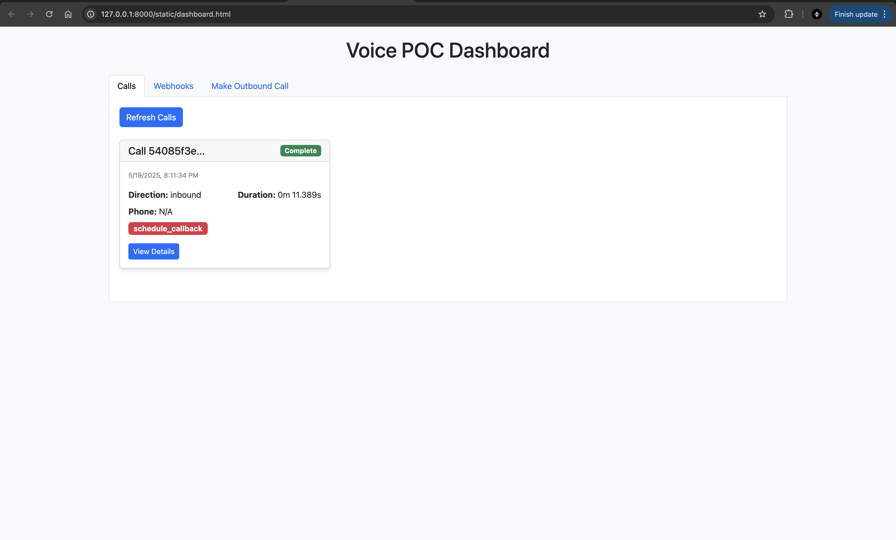
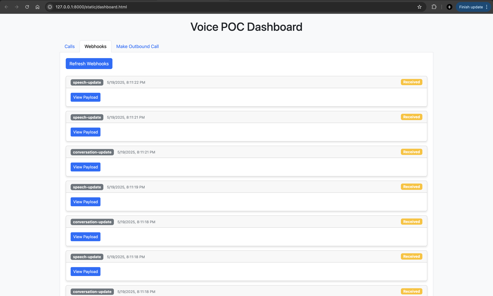
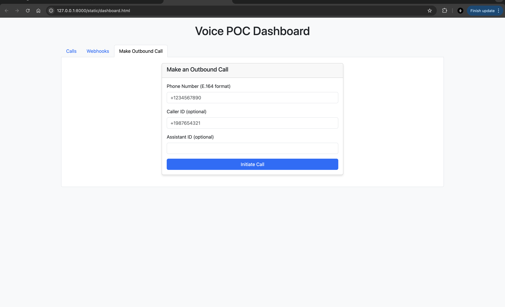

# Voice POC - Intelligent Call Processing with Vapi and Gemini AI

A proof-of-concept application that demonstrates intelligent voice call processing using Vapi for telephony and Google's Gemini AI for intent extraction. This application can handle both inbound and outbound calls, process transcripts, and extract customer intents with high accuracy.



## Architecture Overview

The application follows a modular architecture with clear separation of concerns:

```
voice-poc/
├── app/
│   ├── db/              # Database models and connection handling
│   ├── routes/          # API endpoints and route handlers
│   ├── services/        # Business logic for call processing
│   ├── utils/           # Utility functions like intent extraction
│   └── main.py          # Application entry point
├── static/              # Frontend assets and HTML
└── calls.db             # SQLite database for call data
```

### Key Components:

1. **Webhook Handler**: Receives events from Vapi including call status updates and transcripts
2. **Call Processor**: Processes call data and stores it in the database
3. **Intent Extractor**: Uses Gemini AI to analyze conversation context and extract customer intents
4. **Dashboard**: Web interface to view call data, transcripts, and webhook events
5. **Outbound Caller**: API to initiate outbound calls via Vapi

### Data Flow:

1. Inbound calls are handled by Vapi's voice assistant
2. Call events and transcripts are sent to our webhook endpoint
3. The application processes these events and extracts intents using Gemini AI
4. Call data is stored in a SQLite database
5. The dashboard provides a visual interface to the data

## Setup Instructions

### Prerequisites

- Python 3.10 or higher
- A Vapi account with an API key and assistant configured
- A Google API key for Gemini AI access

### Installation

1. Clone the repository:
   ```bash
   git clone https://github.com/MuhammedBasith/cogniwide-assessment.git
   cd voice-poc
   ```

2. Create and activate a virtual environment:
   ```bash
   python -m venv venv
   source venv/bin/activate  # On Windows: venv\Scripts\activate
   ```

3. Install dependencies:
   ```bash
   pip install -r requirements.txt
   ```

4. Create a `.env` file in the project root with your API keys:
   ```
   GOOGLE_API_KEY=your_google_api_key_here
   VAPI_API_KEY=your_vapi_api_key_here
   VAPI_ASSISTANT_ID=your_vapi_assistant_id_here
   ```

5. Run the application:
   ```bash
   python -m app.main
   ```

6. Access the dashboard at http://localhost:8000

### Configuring Vapi

1. In your Vapi dashboard, set up a new assistant or use an existing one
2. Configure the webhook URL to point to your application's webhook endpoint:
   - If running locally with a tunnel: `https://your-tunnel-url.ngrok.io/webhook/vapi`
   - If deployed: `https://your-domain.com/webhook/vapi`

## API Documentation

### Webhook Endpoint

```
POST /webhook/vapi
```

Receives webhook events from Vapi, including call status updates, transcripts, and end-of-call reports.

### Call Data API

```
GET /api/calls
```

Returns a list of all calls with their metadata, transcripts, and extracted intents.

```
GET /api/calls/{call_id}
```

Returns detailed information about a specific call.

### Webhook Events API

```
GET /api/webhooks
```

Returns a list of all webhook events received from Vapi.

### Outbound Call API

```
POST /outbound-call
```

Initiates an outbound call via Vapi.

Request body:
```json
{
  "assistantId": "your-assistant-id",
  "destination": {
    "type": "number",
    "number": "+1234567890",
    "callerId": "+1987654321"
  }
}
```

Note: Currently, the service only allows outbound calls to US numbers. International calls are not supported at this time.

## Dashboard Features

The dashboard provides a comprehensive view of your voice application:


### Calls Tab
- View all inbound and outbound calls
- See call duration, direction, and extracted intent
- Listen to call recordings
- Read full transcripts and summaries



### Webhooks Tab
- Monitor all webhook events from Vapi
- View raw payload data for debugging
- Track event processing status



### Outbound Call Tab
- Initiate new outbound calls
- Specify destination number and caller ID
- View call initiation results

## Intent Extraction

The application uses Google's Gemini AI to extract customer intents from call transcripts. It analyzes the entire conversation context to accurately identify intents such as:

- Schedule callback
- Technical support
- Billing inquiry
- Product information
- Complaint
- Cancel service
- Change plan
- General inquiry
- Request refund
- Report issue

The intent extraction provides both the identified intent and a confidence score, allowing for high-quality customer service automation.

## Future Improvements

- Add authentication for API endpoints
- Implement more sophisticated conversation analysis
- Add support for multiple Vapi assistants
- Develop more advanced reporting and analytics
- Support for international outbound calls

