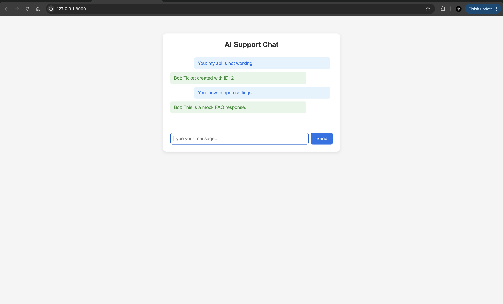

# Multi-Agent AI Chat Support System (PoC-2)



This project is a simple, modular customer support system built with Python and FastAPI. It uses multiple AI agents to understand user questions, route them to the right support logic, and respond in real time. There’s also a minimal web chat interface you can use in your browser.

---

## Architecture Overview

- **Frontend:**
  - A clean, single-page chat UI (see screenshot above) built with HTML and JavaScript.
  - Users type a message and get instant AI responses.

- **Backend (FastAPI):**
  - **IntentClassifierAgent:** Uses Gemini (Google Generative AI) to figure out what kind of help the user needs (FAQ, complaint, or account inquiry).
  - **RoutingAgent:** Sends the message to the right support agent based on the intent.
  - **FAQAgent, TicketAgent, AccountAgent:** Each agent handles a different kind of support (answering FAQs, creating tickets, or handling account questions).
  - **NotifyAgent:** (Stub) Would send notifications via email or WhatsApp (integration ready for SendGrid/Twilio).
  - **Database:** Uses SQLite to store support tickets.
  - **Prompt templates:** Easy to customize how the AI is asked questions.

- **Project Structure:**
  ```
  poc-2/
    ├── agents/         # All agent logic (intent, routing, FAQ, etc)
    ├── database/       # Database connection and helpers
    ├── models/         # Data models (like Ticket)
    ├── static/         # Frontend (index.html, CSS, JS)
    ├── utils/          # Prompt templates
    ├── main.py         # FastAPI app entrypoint
    ├── requirements.txt
    ├── .env            # Your secrets (API keys)
    └── README.md
  ```

---

## ⚡️ Setup Steps

1. **Clone this repo and enter the folder:**
   ```bash
   git clone https://github.com/MuhammedBasith/cogniwide-assessment.git
   cd poc-2
   ```

2. **Install Python dependencies:**
   ```bash
   pip install -r requirements.txt
   ```

3. **Set up your API keys:**
   - Copy `.env.example` to `.env` (or just create `.env`).
   - Add your Google Gemini API key as `GOOGLE_API_KEY=...`

4. **Run the FastAPI server:**
   ```bash
   uvicorn main:app --reload
   ```

5. **Open the chat UI:**
   - Go to [http://localhost:8000/](http://localhost:8000/) in your browser.
   - Type a message and chat with the AI support system!

---

## 📡 API Usage

### POST `/chat`
Send a message to the AI support system and get a response.

**Request:**
```json
{
  "message": "How do I reset my password?"
}
```

**Response:**
```json
{
  "response": "This is a mock account inquiry response."
}
```

- The backend will classify your message and route it to the right support logic.
- The response will be a string (answer, ticket confirmation, etc).

---

## 📝 Notes
- The intent classifier uses Gemini (Google Generative AI) for best results, but you can swap in keyword rules if needed.
- All API keys and secrets should be stored in your `.env` file (never in code).
- The notification agent is ready for integration with SendGrid or Twilio.
- The frontend is intentionally minimal—easy to extend with avatars, chat history, etc.

---
